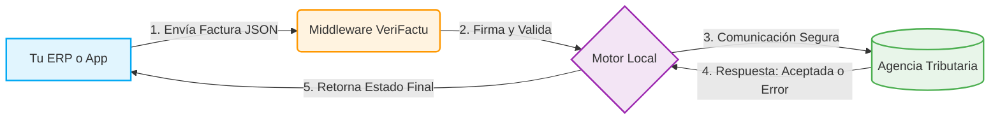

  
  
  
    
  
  <h1>🚀 Documentación del Middleware VeriFactu (B2B)</h1>
  
<b>El puente definitivo entre tu ERP y la Agencia Tributaria (VeriFactu)</b>

  
   
  <h3>🌐 Visita nuestra web oficial para más información sobre el Middleware, planes y soporte:</h3>
  <h2>👉 <a href="https://systemsfgh.com/">https://systemsfgh.com/</a> 👈</h2>
   

> [!IMPORTANT]
> **📢 ESTADO DEL PRODUCTO: PRÓXIMAMENTE DISPONIBLE**
> El Middleware VeriFactu está finalizando su fase de pruebas y **muy pronto estará disponible para descargar e instalar** en tu propia infraestructura. ¡Mantente atento a nuestra web para el lanzamiento oficial!
> 
> **Crea una cuenta con tu email en nuestra web, sin necesidad de aportar más datos.** Serás avisado de forma inmediata de la disponibilidad de la descarga de los binarios para Windows y Linux, así como de la disposición de la licencia con la clave de activación.

Bienvenido al repositorio oficial de documentación de la **API VeriFactu**. Este repositorio contiene las guías técnicas, ejemplos de integración y la arquitectura de nuestro Middleware diseñado para facilitar a otras empresas el cumplimiento normativo exigido por el entorno VeriFactu de la Agencia Tributaria.

---

## ⚖️ Licencia y Uso (¡Importante!)

Este software opera bajo una **Licencia Comercial** de uso a largo plazo. No es software de código abierto (no es MIT ni similar) y su explotación requiere una suscripción activa. 

> [!TIP]
> **🎁 PROMOCIÓN ESPECIAL DE LANZAMIENTO**
> Para facilitar la adopción y las pruebas en entornos productivos, **durante los primeros 18 meses tras la instalación, no se activarán los mecanismos de cobro por licencia**. Podrás utilizar y validar el Middleware sin restricciones comerciales durante este extenso periodo de gracia. Las licencias adquiridas están pensadas para una viabilidad a muy largo plazo.
> 
> Esta licencia inicial permite hasta tres emisores simultáneos; esto es, llevar las operaciones de tres empresas distintas independientes sin ningún límite de facturas emitidas. Cuando el Middleware esté público disponible, pruébenlo sin miedo y si les satisface no duden en pasarlo a su producción. No habrá sorpresas en el precio de las suscripciones tras este tiempo, ya que estas se ajustarán a la media del mercado. Además, actualmente se está estudiando la viabilidad de ofrecer licencias perpetuamente gratuitas para proyectos de un solo emisor con un volumen de hasta 1.000 operaciones anuales.

---

## 🏗️ ¿Cómo funciona?

El Middleware actúa como una caja negra que recibe tus facturas en formato genérico JSON (desde tu ERP en C#, Delphi, PHP, etc.) y se encarga de firmarlas, estructurarlas y enviarlas a Hacienda, devolviéndote el estado.

---

## 📚 Estructura de la Documentación

Toda la documentación está estructurada en la carpeta `docs/`:

1.  **[Visión General del Middleware](docs/01_vision_general.md)** - Conceptos básicos y propósito del sistema.
2.  **[Arquitectura de Componentes](docs/02_arquitectura_de_componentes.md)** - Diagrama general del Frontend, Backend y BD.
3.  **[Conceptos y Flujo de Trabajo (Workflows)](docs/03_conceptos_flujo_de_trabajo.md)** - Cómo funciona la ingesta de facturas y los estados.
4.  **[El Entorno de Simulación](docs/04_entorno_simulacion.md)** - Entorno seguro para pruebas sin enviar a la AEAT real.
5.  **[Integración de la API (REST)](docs/05_integracion_api.md)** - Referencia técnica de los _endpoints_ (Ingesta, Ack,...).
6.  **[Diccionario de Datos (API y BD)](docs/06_diccionario_datos.md)** - Definición del modelo JSON de peticiones y respuestas.
7.  **[Rutas y Estructura de Proyecto](docs/07_rutas_y_estructura.md)** - Organización interna del desarrollo.
8.  **[Monitorización y Registro (Logging)](docs/08_monitorizacion_y_logs.md)** - Información operativa del sistema.

---

## 🛠️ Guías de Integración por Lenguaje (SDKs)

En la carpeta `docs/sdk_integration_guides/` encontrarás guías listas para ser utilizadas en tu entorno de desarrollo. Ejemplos de conexión para:

*    [**Ver Guía de Integración Node.js en el navegador**](http://htmlpreview.github.io/?https://github.com/SysytemsFGH/API-Verifactu-SystemsFGH/blob/main/docs/sdk_integration_guides/NODEJS_INTEGRATION_GUIDE.html)
*    [**Ver Guía de Integración Python en el navegador**](http://htmlpreview.github.io/?https://github.com/SysytemsFGH/API-Verifactu-SystemsFGH/blob/main/docs/sdk_integration_guides/PYTHON_INTEGRATION_GUIDE.html)
*    [**Ver Guía de Integración C# en el navegador**](http://htmlpreview.github.io/?https://github.com/SysytemsFGH/API-Verifactu-SystemsFGH/blob/main/docs/sdk_integration_guides/CSHARP_INTEGRATION_GUIDE.html)
*    [**Ver Guía de Integración PHP en el navegador**](http://htmlpreview.github.io/?https://github.com/SysytemsFGH/API-Verifactu-SystemsFGH/blob/main/docs/sdk_integration_guides/PHP_INTEGRATION_GUIDE.html)
*    [**Ver Guía Delphi 7**](http://htmlpreview.github.io/?https://github.com/SysytemsFGH/API-Verifactu-SystemsFGH/blob/main/docs/sdk_integration_guides/DELPHI7_INTEGRATION_GUIDE.html) • [**Ver Guía Delphi 10+**](http://htmlpreview.github.io/?https://github.com/SysytemsFGH/API-Verifactu-SystemsFGH/blob/main/docs/sdk_integration_guides/DELPHI10_INTEGRATION_GUIDE.html)

## 🚀 Empezar

Si eres nuevo en la plataforma, te recomendamos leer primero la **[Visión General](docs/01_vision_general.md)** y posteriormente revisar la guía de integración del lenguaje de programación que utilices en tu empresa.
